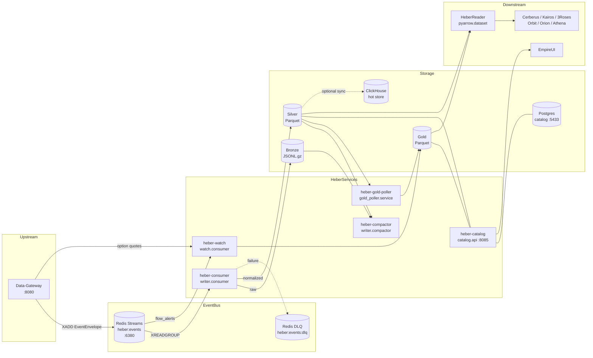
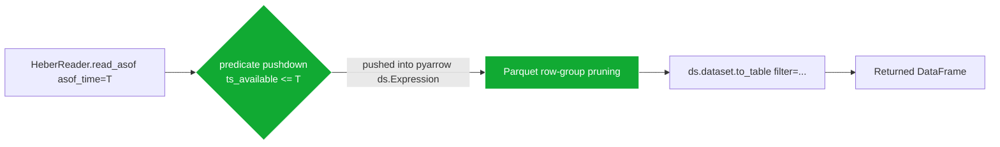
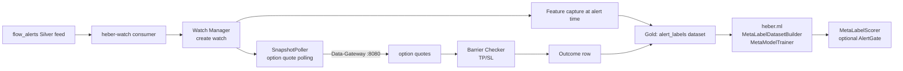

# System Architecture

How events flow through Heber, how the lake is laid out, and how zero-leakage is enforced. Companion docs: [project overview](./project-overview-pdr.md), [codebase summary](./codebase-summary.md), [configuration guide](./configuration-guide.md).

## Service Topology



## End-to-End Event Flow

```mermaid
sequenceDiagram
    autonumber
    participant DG as Data-Gateway
    participant RS as Redis Stream<br/>heber:events
    participant CONS as EventConsumer
    participant BR as BronzeWriter
    participant SL as SilverWriter
    participant DLQ as heber:events:dlq

    DG->>RS: XADD envelope_json
    CONS->>RS: XREADGROUP (batch 500)
    CONS->>CONS: parse EventEnvelope (Pydantic)
    alt ValidationError
        CONS->>DLQ: XADD reason=validation_error
    else parsed OK
        CONS->>CONS: dedupe by event_id (BLAKE2b-128)
        alt duplicate
            CONS->>RS: XACK (drop)
        else new event
            CONS->>CONS: set ts_available = now()
            CONS->>BR: write JSONL.gz (provider/feed/dt/hour)
            alt is_bronze_only_feed(feed)
                CONS->>RS: XACK (stop after Bronze)
            else contracted Silver feed
                CONS->>CONS: resolve_silver_feed (alias map)
                CONS->>CONS: normalize_envelope_for_silver (instrument-key validation)
                CONS->>CONS: enforce_required_non_null_fields
                CONS->>SL: append typed Parquet row
                CONS->>RS: XACK
            else uncontracted
                CONS->>DLQ: XADD reason=uncontracted_feed
            else contracted-but-unmapped
                CONS->>DLQ: XADD reason=unmapped_feed
            end
        end
    end
    note over CONS,DLQ: On runtime errors: retry with exponential backoff;<br/>DLQ after HEBER_REDIS_PROCESS_MAX_RETRIES (default 3)
```

## Storage Layers

```mermaid
flowchart TB
    subgraph BR[Bronze raw immutable]
        BRpath[bronze/provider={}/feed={}/dt={}/hour={}/*.jsonl.gz]
    end
    subgraph SL[Silver typed-flat]
        SLpath[silver/feed={}/instrument_type={}/dt={}/hour={}/*.parquet]
    end
    subgraph GD[Gold derived]
        GDpath[gold/dataset={}/project={}/version={}/dt={}/*.parquet]
    end

    BR -->|envelope_to_silver_row<br/>rename + type coerce only| SL
    SL -->|features / labels / joins<br/>ts_available enforced| GD
    BR -.backfill.-> SL
    GD -->|version=v{N} per project| GD
```

| Layer | Format | Mutability | Partitions | Purpose |
|-------|--------|------------|------------|---------|
| Bronze | JSONL.gz | append-only, immutable | `provider / feed / dt / hour` | Durable raw envelope archive — Silver can always be rebuilt from here |
| Silver | Parquet (typed via `heber/schemas/silver.py`) | append-only | `feed / instrument_type / dt` (+ `hour` for high-volume) | Query layer. Rename + type coerce only. No derived fields. |
| Gold | Parquet | append-only, versioned | `dataset / project / version / dt` | Features, labels, enriched datasets. `ts_available >= ts_event` invariant. |

All paths are relative to `HEBER_DATA_ROOT` (default `/Volumes/heber/data`). See [configuration guide](./configuration-guide.md#core-runtime-settings).

## Zero-Leakage

Heber's load-bearing contract. Every read must respect the time at which data was actually available to the system, not when it was effective upstream.

### Three timestamps on every record

| Field | Meaning | Set by |
|-------|---------|--------|
| `ts_event` | When the event happened upstream (e.g. trade tick time) | Producer (Data-Gateway) |
| `ts_ingest` | When Heber received it from Redis | Heber consumer |
| `ts_available` | When it is **safe to query** (the only field used for leakage filtering) | Heber writer, on persistence |

### How reads stay leakage-free



The `ts_available <= asof_time` filter is pushed into the pyarrow dataset scan **before** rows materialize in memory. It is *not* a post-filter on a fully-loaded DataFrame. This means:

1. Parquet column statistics let pyarrow skip entire row groups.
2. The reader never sees future data in any intermediate representation.
3. Backtests cannot accidentally use a `.head()` peek that bypasses the filter.

### Other leakage guards

- `HeberReader.asof_join(left, right, ...)` filters the **right** table on `ts_available <= left.ts_event` (with optional `tolerance`) before merging.
- `HeberReader.write_gold(...)` validates `ts_available >= ts_event` row-wise; rejects the batch otherwise.
- `heber.health_monitor` runs leakage spot-checks on a sample of partitions every cycle and emits Prometheus metrics on violations.

## Bronze → Silver Normalization Contract

Centralized in `heber/writer/ingest_contracts.py` so live ingest and Bronze-to-Silver backfill use *exactly* the same rules. Drift between paths would break reproducibility.

```mermaid
flowchart TB
    E[EventEnvelope from Redis] --> P[Pydantic validation]
    P -->|invalid| DLQ1[DLQ: validation_error]
    P -->|ok| D[Dedupe by event_id]
    D -->|duplicate| ACK1[XACK drop]
    D -->|new| TS[set ts_available = now]
    TS --> BW[BronzeWriter — always]
    BW --> CHK{is_bronze_only_feed?<br/>(news, institution_holdings)}
    CHK -->|yes| ACK2[XACK done]
    CHK -->|no| CHK2{contracted feed?<br/>CONTRACTED_RAW_FEEDS}
    CHK2 -->|no| DLQ2[DLQ: uncontracted_feed]
    CHK2 -->|yes| MAP[resolve_silver_feed<br/>FEED_ALIASES]
    MAP -->|not mapped| DLQ3[DLQ: unmapped_feed]
    MAP -->|mapped| NK[normalize_envelope_for_silver<br/>instrument-key validation]
    NK -->|invalid key| DLQ4[DLQ: invalid_instrument_key]
    NK -->|ok| NR[enforce_required_non_null_fields]
    NR -->|missing| DLQ5[DLQ: missing_required_field]
    NR -->|ok| SW[SilverWriter — typed Parquet]
    SW --> ACK3[XACK]
```

Key feed aliases (`FEED_ALIASES` in `ingest_contracts.py`):

- `flow` → `flow_alerts`
- `ticker_flow` → `flow_alerts`
- `greeks` → `greek_exposure`
- `daily_bars` → `bars`
- `ftds` → `ftd`
- `short_interest`, `short_volume` → `short_data`

Bronze-only feeds (`BRONZE_ONLY_SILVER_DATASETS`): `news`, `institution_holdings`.

## Catalog

Postgres-backed metadata (`heber/catalog/db.py`):

- `datasets` + `dataset_versions` — registered datasets, schema versions.
- `instrument_registry` + `instrument_provider_map` — canonical instrument identity + per-provider mapping.
- `feed_mappings` — provider feed → Silver dataset name.
- `data_coverage` — per-instrument, per-dataset coverage window + approximate row counts.

The catalog API (`heber-catalog`, port `8085`) periodically scans Silver on disk for new feed partitions and updates coverage in the background (`_periodic_discovery_loop`, controlled by `HEBER_CATALOG_DISCOVER_INTERVAL_SECONDS`). It auto-creates tables in `dev`; staging/prod use Alembic (`alembic/`).

See [API reference](./api-reference.md#catalog-rest-api) for endpoints.

## Watch & ML Meta-Labeling



Outputs land in `gold/dataset=alert_labels/...` with `ts_available` set to barrier-hit time (not alert time). This prevents the meta-labeling model from seeing the future when reading labels through `HeberReader`.

## Gold Pipeline Orchestration

`heber-gold-poller` (`heber.gold_poller.service`) wakes daily at `HEBER_GOLD_POLLER_EOD_HOUR:HEBER_GOLD_POLLER_EOD_MINUTE` (ET; defaults `16:35`) and runs registered pipelines that read Silver and write Gold. Pipelines return one of two shapes:

- **Nested**: `{gold_dataset_name: {"status": ..., "rows": N, "path": ...}}` — used by `darkpool_features`, `oi_momentum_features`, `iv_surface_features`, `flow_toxicity_features`, `flow_normalization_features`, `market_intel_features`.
- **Flat**: `{"status": ..., "rows": N, "path": ...}` — used by `sector_flow_features`, `trend_scan_features`, `flow_context_features`, `straddle_momentum_features`, `ticker_base_rates`, `excursion_analytics`, `alert_labels`.

The orchestrator normalizes both before aggregation.

Skip specific pipelines via `HEBER_GOLD_POLLER_DISABLED_PIPELINES="pipeline_a,pipeline_b"`.

## Health & Observability

| Channel | Source | Use |
|---------|--------|-----|
| Prometheus `/metrics` | `heber/ops/metrics.py` on each service (`9090` consumer, `9091` watch) | Live SLI tracking |
| `heber health-dataflow` | `heber/ops/dataflow_health.py` | Scheduled JSON proof-of-flow (Gateway → Ingest → Storage), reports to `HEBER_HEALTH_REPORT_DIR` |
| `heber health-daily` | `heber/ops/daily_health.py` | EOD 7-check report (partitions, cross-feed, Soda, fill rate, zero-leakage, DLQ, Gold), reports to `HEBER_DAILY_HEALTH_REPORT_DIR` |
| Catalog `GET /health` | `heber/catalog/api.py` | Liveness for the API service |
| Structured logs | structlog JSON on stdout, plus `heber-watch:*` and `heber-consumer:*` files in container logs | Forensics and incident response |

See [deployment guide](./deployment-guide.md#monitoring) for wiring details.

## Optional / Staged OSS Components

Present in the tree but not currently on the hot path:

- **Iceberg** (`heber/storage/iceberg_catalog.py`, `iceberg_writer.py`) — migration staged; not wired into `HeberReader`.
- **lakeFS** (`heber/versioning/`) — Gold versioning still uses filesystem `version=*` directory discovery.
- **Apicurio / schema registry** (`heber/schema_registry/`) — Confluent-compatible client; off by default.
- **OpenMetadata** (`heber/catalog/openmetadata_client.py`) — optional sync from the Heber catalog.
- **Feast** (`heber/feast/`, `heber/features/`) — feature views; off by default in local dev.

These are intentionally available as path forward; turning them on requires Docker stack changes and is out of scope for the current default deployment.
